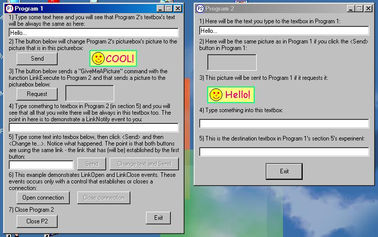



## DDE Example \- communicating between apps

### Description

This tutorial demonstrates DDE conversation with which you can easyly communicate between your apps.
 
### More Info
 

             |
---                |---
**Submitted On**   |2002-05-01 15:05:14
**By**             |[Peeter Puusemp](https://github.com/Planet-Source-Code/PSCIndex/blob/master/ByAuthor/peeter-puusemp.md)
**Level**          |Intermediate
**User Rating**    |4.8 (174 globes from 36 users)
**Compatibility**  |VB 5\.0, VB 6\.0
**Category**       |[DDE](https://github.com/Planet-Source-Code/PSCIndex/blob/master/ByCategory/dde__1-28.md)
**World**          |[Visual Basic](https://github.com/Planet-Source-Code/PSCIndex/blob/master/ByWorld/visual-basic.md)
**Archive File**   |[DDE\_Exampl78016512002\.zip](https://github.com/Planet-Source-Code/peeter-puusemp-dde-example-communicating-between-apps__1-34285/archive/master.zip)

